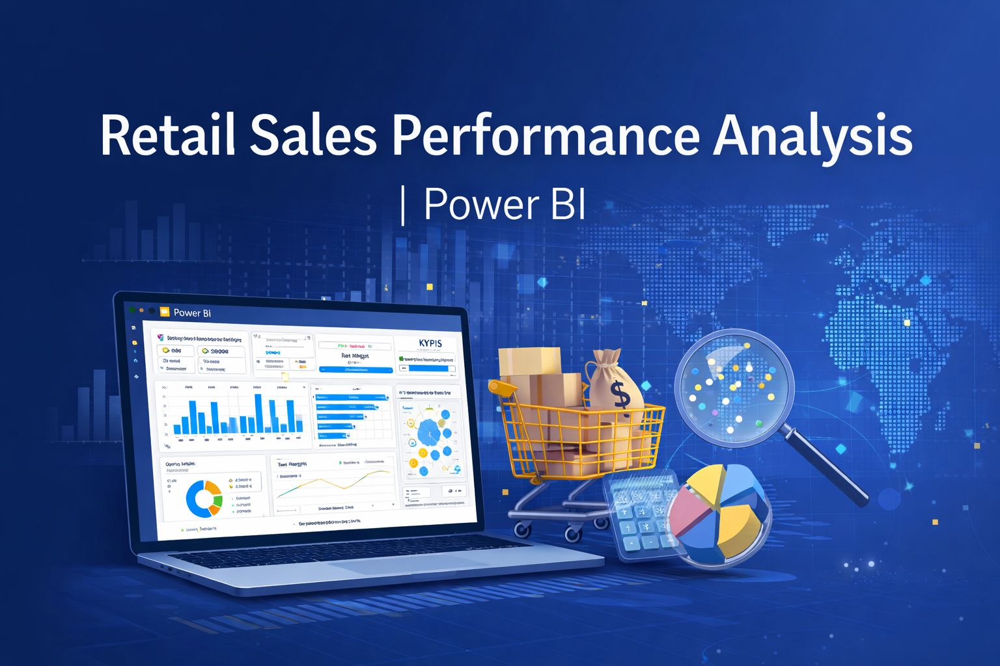
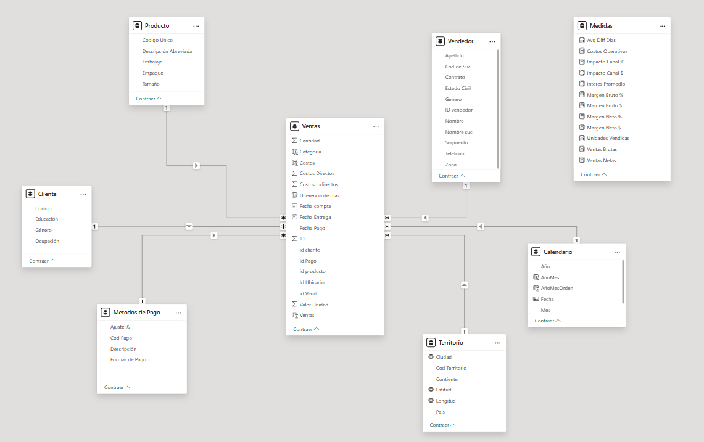
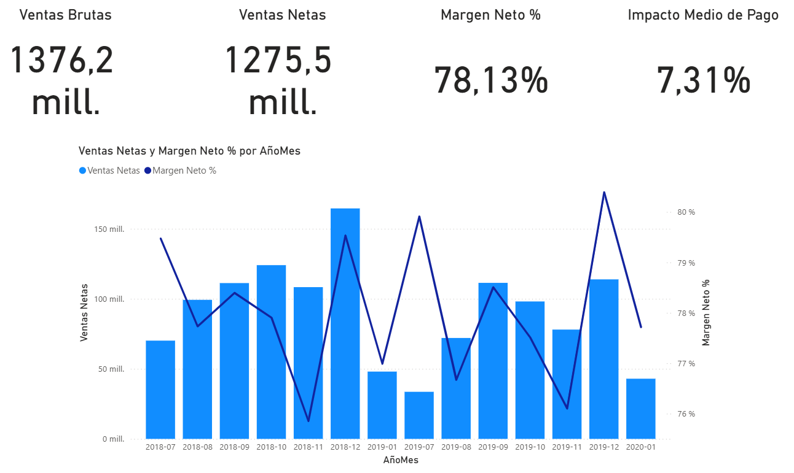
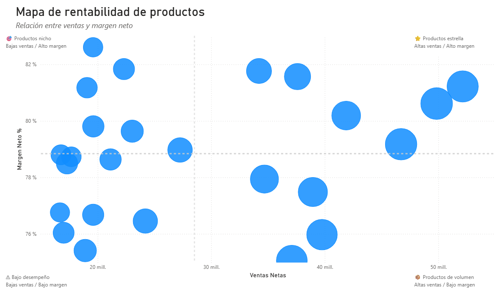
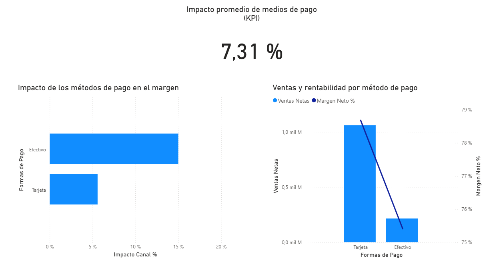
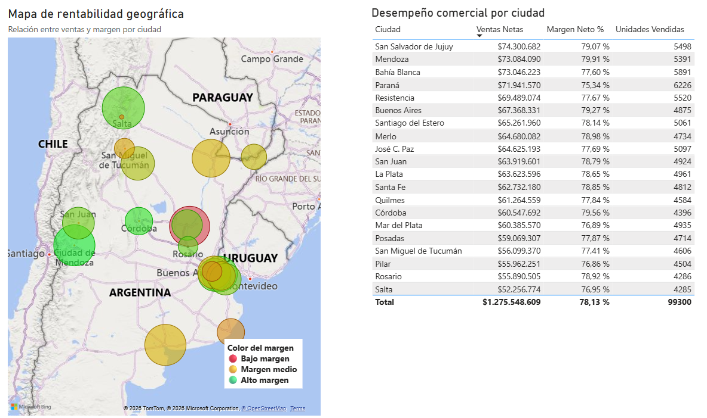

<p align="center">
  
</p>

# Retail Sales Performance Analysis | Power BI

This project analyzes the commercial performance of a fictional retail company using Power BI.  
The objective is to explore sales patterns, profitability drivers, product performance and geographic distribution in order to generate business insights that support decision-making.

The analysis includes multiple dashboards focused on sales trends, product profitability, payment channel impact and geographic performance.

**Note:** The README provides a high-level overview of the project, while the detailed analytical interpretation of each dashboard is documented in the `/docs` directory.

---

## Versión en español

Este proyecto analiza el desempeño comercial de una empresa retail ficticia utilizando **Power BI**.

El objetivo es identificar los principales **drivers de rentabilidad**, evaluar el impacto de productos, métodos de pago y distribución geográfica, y generar **insights analíticos que apoyen la toma de decisiones estratégicas**.

El proyecto incluye varios dashboards interactivos que permiten explorar el negocio desde distintas perspectivas:

- evolución de ventas y rentabilidad
- desempeño de productos
- impacto de métodos de pago
- análisis geográfico del negocio

---

## Project Highlights

- Built a **Power BI dashboard suite** analyzing retail sales performance across products, payment channels and geographic regions.
- Designed a **star schema data model** to support efficient analytical queries.
- Implemented **DAX measures** to calculate KPIs such as Net Sales, Net Margin and Payment Channel Impact.
- Identified **key profitability drivers** across product categories and cities.
- Documented the complete analytical process using structured Markdown reports.

---

## How to Explore the Project

1. Review the **Executive Overview dashboard** to understand overall sales and margin stability.
2. Explore **Product Performance** to identify high-performing and underperforming products.
3. Analyze **Payment & Operations Impact** to understand how payment channels influence profitability.
4. Use **Geographic Performance** to explore regional sales distribution and margin differences.
5. For deeper interpretation, read the analytical reports in the `/docs` directory.

---


## Business Questions

The analysis was designed to answer several key business questions related to sales performance and profitability.

- How do sales and profitability evolve over time?
- Which products contribute the most and least to business profitability?
- Are there products with high sales volume but low profitability?
- How do payment methods impact the final margin?
- Which geographic areas concentrate the highest levels of sales and profitability?

---

## Preguntas de negocio

El análisis fue diseñado para responder una serie de preguntas clave relacionadas con el desempeño comercial y la rentabilidad del negocio.

- ¿Cómo evolucionan las ventas y la rentabilidad a lo largo del tiempo?
- ¿Qué productos aportan mayor y menor margen al negocio?
- ¿Existen productos con alto volumen de ventas pero baja rentabilidad?
- ¿Cómo impactan los métodos de pago en el margen final?
- ¿Qué zonas geográficas concentran mayores niveles de ventas y rentabilidad?

---

## Data Model

The project uses a **star schema data model**, a common architecture in Business Intelligence systems that improves performance and simplifies analytical queries.



The model is centered around a **Sales fact table**, which stores transactional information for each sale, and several **dimension tables** that provide context for the analysis.

Main tables include:

- **Sales (Fact Table)** – transactional data such as units sold, product value, operational costs and sales dates.
- **Products** – product category, size and product attributes.
- **Customers** – customer segment information.
- **Payment Methods** – payment channel and associated financial adjustments.
- **Territory** – geographic information including city and coordinates.
- **Calendar** – date dimension used for time-based analysis.

This structure enables efficient analysis across multiple dimensions such as **products, time, geography and payment channels**.

---

## Modelo de datos

El proyecto utiliza un **modelo tipo estrella (Star Schema)**, una de las arquitecturas más utilizadas en sistemas de Business Intelligence por su eficiencia y claridad analítica.

El modelo está centrado en una **tabla de hechos de ventas**, que contiene las transacciones del negocio, y varias **tablas dimensión** que permiten analizar los datos desde distintas perspectivas.

Tablas principales del modelo:

- **Ventas (tabla de hechos)** – contiene las transacciones del negocio, incluyendo unidades vendidas, valor del producto, costos operativos y fechas de venta.
- **Productos** – información sobre categorías, tamaños y atributos del producto.
- **Clientes** – segmentación de clientes.
- **Métodos de pago** – canales de pago y ajustes financieros asociados.
- **Territorio** – información geográfica como ciudad y coordenadas.
- **Calendario** – dimensión temporal utilizada para el análisis de tendencias en el tiempo.

Esta estructura permite analizar el negocio de forma eficiente desde distintas dimensiones como **producto, tiempo, territorio y canal de pago**.

---

## Tools Used

- **Power BI** – data modeling and dashboard development  
- **DAX** – calculation of business metrics and KPIs  
- **Star Schema Data Modeling** – analytical data structure  
- **Business Intelligence visualization techniques**

---

## Skills Demonstrated

- Business Intelligence Analysis
- Data Modeling (Star Schema)
- Power BI Dashboard Development
- DAX Measures & KPI Design
- Analytical Interpretation of Business Data
- Data Visualization for Decision Support

---

## Repository Structure

The project repository is organized to separate **data, dashboards, documentation and visual assets**, following a structure commonly used in data analytics and Business Intelligence projects.

```
powerbi-analisis-ventas-rentabilidad
│
├── assets/
│   ├── executive_overview.png
│   ├── product_performance.png
│   ├── payment_impact.png
│   ├── geographic_performance.png
│   ├── modelo_estrella.png
│   ├── powerquery_cliente_steps.png
│   ├── powerquery_metodospago_steps.png
│   └── powerquery_producto_steps.png
│
├── dashboard/
│   └── Ventas_Rentabilidad_Portafolio_v1.pbix
│
├── data/
│   ├── Base-de-datos.xlsx
│   ├── Metodos-de-pago.pdf
│   └── Territorio.txt
│
├── docs/
│   ├── 01_contexto_y_preguntas.md
│   ├── 02_auditoria_datos.md
│   ├── 03_modelo_datos.md
│   ├── 04_executive_overview.md
│   ├── 05_product_performance.md
│   ├── 06_payment_impact.md
│   └── 07_geographic_performance.md
│
└── README.md
```

**Folder description**

**assets/**
Contains images used in the README such as dashboard screenshots, data model diagrams and Power Query process illustrations.

**dashboard/**
Includes the Power BI file (.pbix) containing the full data model and interactive dashboards.

**data/**
Source files used to build the model, including the main dataset and complementary documentation.

**docs/**
Detailed analytical reports written in Markdown for each stage of the project.
These documents include the complete interpretation of the dashboards, analytical observations and executive insights.

**README.md**
Overview of the project, including objectives, dashboards and key insights.

---

## Dashboards

The analysis is organized into four interactive dashboards, each designed to answer specific business questions.

---

### 1. Executive Overview

Provides a high-level view of the overall performance of the business.



Main elements:

- Gross Sales
- Net Sales
- Net Margin
- Payment Channel Impact
- Sales and margin evolution over time

This dashboard helps understand the **overall stability and profitability of the business**.

---

### 2. Product Performance

Analyzes the relationship between sales volume and profitability at the product level.



Key visualization:

- Scatter plot showing:
  - Net Sales
  - Net Margin %
  - Units Sold

Products are positioned within four strategic quadrants:

- High sales / High margin
- High sales / Low margin
- Low sales / High margin
- Low sales / Low margin

This analysis helps identify **star products, growth opportunities and low-performing products**.

---

### 3. Payment & Operations Impact

Evaluates how different payment methods affect the final profitability of the business.



Main insights explored:

- Impact of payment channels on margins
- Comparison of sales and profitability by payment method

This dashboard highlights how **financial transaction channels influence operational profitability**.

---

### 4. Geographic Performance

Analyzes the geographic distribution of sales and profitability across cities.



Key visualizations include:

- Geographic map where:
  - Bubble size represents **Net Sales**
  - Color represents **Net Margin %**
- Ranking table of city performance

This dashboard helps identify **regional patterns in sales performance and profitability**.

---

## Dashboards del proyecto

El análisis se organiza en cuatro dashboards principales, cada uno diseñado para responder preguntas específicas del negocio.

1️⃣ **Executive Overview**  
Visión general del desempeño del negocio, incluyendo evolución de ventas y estabilidad de los márgenes.

2️⃣ **Product Performance**  
Análisis del portafolio de productos para identificar productos estrella, productos de volumen y productos de bajo desempeño.

3️⃣ **Payment & Operations Impact**  
Evaluación del impacto de los métodos de pago en la rentabilidad final del negocio.

4️⃣ **Geographic Performance**  
Análisis territorial del negocio que permite identificar qué ciudades concentran mayor actividad comercial y rentabilidad.

---

## Detailed Analysis

Each dashboard includes a detailed analytical report with observations and insights.  
The full analysis for each section is available in the `docs` folder.

- [Executive Overview Analysis](docs/executive_overview.md)
- [Product Performance Analysis](docs/product_performance.md)
- [Payment & Operations Impact Analysis](docs/payment_impact.md)
- [Geographic Performance Analysis](docs/geographic_performance.md)

These documents include the complete interpretation of the dashboards, covering analytical observations, executive insights, and contextual explanations of the results.

---

## Key Insights

The analysis reveals several relevant patterns in the commercial performance of the business:

- **Stable profitability:** The business maintains a relatively stable net margin around **78%**, suggesting a consistent cost structure and a healthy operational model.

- **Product portfolio dynamics:** Some products generate high sales volume but relatively lower margins, indicating potential opportunities for pricing optimization, cost reduction or portfolio adjustments.

- **Impact of payment channels:** Payment methods have a measurable impact on profitability. Although the average impact remains moderate, changes in payment channel composition could affect margins in the future.

- **Geographic distribution of sales:** Sales activity is distributed across multiple cities rather than being concentrated in a single location. Some cities combine strong sales with competitive margins, while others present slightly lower profitability despite higher sales volumes.

Overall, the analysis suggests a **solid and relatively stable commercial structure**, with opportunities to further optimize product strategy, payment channels and regional performance.

---

## Author

**Cristián Andrés Galleguillos Vega**

Biologist  
MSc in Natural Resources Engineering  
MSc in Data Science & Big Data  

📍 Chile  
🔗 LinkedIn: https://www.linkedin.com/in/cristi%C3%A1n-galleguillos-vega-267343198/

This project is part of my portfolio focused on **data analytics, business intelligence and decision-support analysis**.